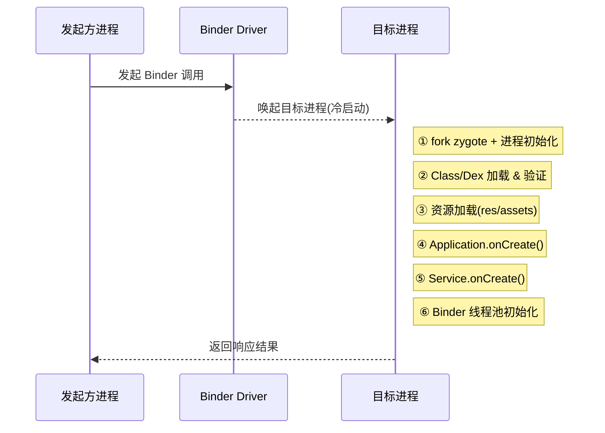

夸克的面试明显比美团难多了，非常底层的问题，由于我的项目里面提到了网络协议，`Binder`机制、没想到这个团队就是做这些的，听面试官讲，这个部门主要是做网络库封装，`arkts`到移动端的`native binding`能力，程序冷启动优化等业务。因为个人项目经历和投递岗位重合度比较高，面试官疯狂提问，有些东西都太久远了，我都快记不得了😒😒😒

## 1 岗位介绍

负麦夸克鸿蒙/安卓客户端核心功能模块的设计与开发，保障业务性能与稳定性。
优化鸿蒙移动端用户体验，通过技术手段提升交互流畅度与资源利用率。参与技术基础设施建设，推动研发流程标准化与工具链优化。
**岗位要求**

- 一年以上工作经验，计算机基础扎实，熟悉数据结构和算法，在网络编程，多线程，操作系统方面有较深的知识掌握和实践经验,
- 孰练掌握鸿蒙/安卓系统开发技术栈(如`ArKTS`/`Java`)或前端开发流程，有中大型移动端项目经验优先熟悉移动端性能调优及其原理(内存管理、渲染优化等)，能解决复杂技术问题。
- 技术视野开阔，关注行业趋势，具备新技术调研与落地能力。沟通协作能力强，能在跨团队合作中高效推动技术方案落地。

## 2 介绍项目

个人介绍，工作经历介绍，项目介绍等，开始暖场。

## 3 围绕项目使用的技术进行提问

### 3.1 网络协议相关

#### 3.1.1 谈一谈SSH协议

**原问题**：`SSH`协议如何保证安全的(主要是讲身份验证的方式和过程)；

::: details 查看答案

SSH协议网上有很多讲解的，这里不再赘述，我猜面试官应该是想让我简答一下SSH保证安全性的核心机制。首先，SSH是一种用于在不安全，不受信任的网络上进行远程shell会话，或者用于执行文件传输动作的安全通信协议。是介于传输层和应用层之间的一种安全协议。

首先，我们来看下**SSH的整体会话流程**：

1. **TCP连接建立**：客户端连接服务器的22端口，建立TCP连接。
2. **协议版本交换**：双方交换SSH版本信息，确保兼容性（通常使用SSH-2）。
3. **密钥交换**：使用Diffie-Hellman（DH）算法生成共享对称密钥，用于后续加密。同时协商加密算法、哈希算法和压缩方法。
4. **服务器身份验证**：服务器发送其主机公钥（通常RSA、DSA或ECDSA）。客户端检查公钥指纹是否匹配本地known_hosts文件。如果是首次连接，客户端提示用户手动验证指纹并添加到known_hosts中，防止MITM攻击。
5. **客户端身份验证**：服务器根据配置要求客户端进行认证（详见下文）。
6. **会话建立**：认证成功后，建立加密通道，用于命令执行或文件传输。
7. **数据传输**：所有数据使用共享密钥加密，并附加MAC（Message Authentication Code）确保完整性。

从上面的流程，我们可以看到，安全机制主要体现在SSH会话建立过程和数据传输过程，身份验证是一个双向的验证过程，其次会话阶段的数据传输也使用对称加密的方式，让实际在中间网络中报文都是密文的格式。

**SSH支持多种客户端身份验证方法**，由服务器配置决定，这些方法可以组合使用（如密码+公钥），或按优先级顺序尝试。常见方法如下表所示：

| 方法名称                            | 描述                                                         | 安全性评估               | 适用场景               |
| ----------------------------------- | ------------------------------------------------------------ | ------------------------ | ---------------------- |
| 密码认证 (Password)                 | 客户端输入用户名和密码，加密后发送给服务器验证。             | 中等（易受暴力破解影响） | 简单用户登录           |
| 公钥认证 (Public Key)               | 使用公钥-私钥对：客户端用私钥签名挑战，服务器用公钥验证。    | 高（私钥不传输）         | 自动化脚本、管理员访问 |
| 主机-based认证 (Host-based)         | 基于客户端主机名/IP，使用shosts.equiv文件验证，无需密码。    | 低（易伪造IP）           | 封闭网络内部           |
| 键盘交互认证 (Keyboard-Interactive) | 服务器发送多个提示（如密码或挑战），客户端响应，支持PAM模块。 | 中等至高（可集成多因素） | 需要额外验证的场景     |
| GSSAPI/Kerberos认证                 | 使用Kerberos票据进行单点登录，无需密码。                     | 高（集成企业级认证系统） | 大型企业环境           |
| 挑战响应认证 (Challenge-Response)   | 与键盘交互类似，由后端系统发送挑战并验证响应。               | 中等（依赖后端安全性）   | PAM集成认证            |

:::

#### 3.1.2 谈一谈网络报文的安全传输手段和技术

**原问题** : 网络中报文如何保证传输安全，用到的加密技术有哪些？

::: details 查看答案

确保网络中的报文传输安全是一个系统工程，主要体现在以下方面：

1. 身份认证
2. 密文传输
3. 报文完整性保证

**身份认证技术**: 通过数字证书与公钥基础设施(PKI)来保证，

- **数字证书：** 由受信任的第三方机构`数字证书颁发机构`签发的电子文档，将实体的身份信息（如域名、公司名）与其公钥绑定。证书本身包含持有者的公钥和 CA 的数字签名；
- **CA (Certificate Authority)：** 可信任的第三方机构，负责核实证书申请者的身份并签发证书；
- **链式信任：** 根 CA -> 中间 CA -> 服务器证书。客户端（如浏览器）内置信任的根 CA 列表。通过验证证书链上所有 CA 的签名，最终信任服务器证书中的公钥确实属于它声明的实体；
- **应用：** TLS/SSL 握手开始时，服务器将其证书发送给客户端，客户端验证证书的有效性（包括是否由可信 CA 签发、是否在有效期内、是否匹配访问的域名等）。客户端也可以提供证书供服务器验证（双向认证，较少用于普通 web 访问）；

**密文传输技术**:  主要是通过加密算法实现，加密方式又可以分为对称加密和非对称加密。

- **对称加密：** 加密和解密使用同一个密钥。优点是速度快，适合加密大量数据，比如常见的`AES`算法；
- **非对称加密 (公钥加密)**：使用一对密钥，公钥 (公开) 和私钥 (保密)。用公钥加密的数据只能用对应的私钥解密，反之亦然。优点是密钥分发方便，解决了对称加密的密钥交换问题，但速度慢得多，常见算法有`RSA`, `ECC`, `DSA`等等。
- **应用：** 主要用于两个关键环节：•**密钥协商/交换：** 在对称加密会话开始前，安全地协商出一个临时的对称会话密钥（如使用 Diffie-Hellman 及其变种）。•**数字签名：** 用于身份认证和确保完整性/抗抵赖性。

**报文完整性保证**：发送方使用自己的`私钥`对特定数据（如原始报文或报文的哈希值）进行加密，生成签名，接收方使用发送方的`公钥`（通常来自证书）解密该签名，并将解密结果与自己对原始数据计算的哈希值进行比对。匹配则证明数据未被篡改且确实来自声称的发送方。例如，在TLS协议中，`HMAC`用于验证报文在已建立的加密通道中的完整性。

:::

#### 3.1.3 如何解决网络中的丢包问题

**原问题**：网络数据传输过程中出现公共网络丢包的情况，如何定位和分析，并如何做好优化

::: details 查看答案

**丢包节点定位：**
如果出现丢包的话，首先要找到发生丢包的节点，常见的方式可以使用ICMP工具(ping, trace)查看网络的传输质量和对报文的传输路径进行追踪，或者使用更高阶的工具`mtr`, 实时显示路径中每一跳的丢包率(结合 traceroute + ping)，比 `ping` 更精准。

个人感觉面试官这里问的优化应该是应用侧能做哪些优化？首先如果是对于TCP协议本身，如果丢包引发多次重传，TCP有自己的流控机制(拥塞控制)，如果是对接收端的优化，可以调整接收端的报文缓冲区大小或者缓存队列的大小。

:::

#### 3.1.4 协议传输效率优化的手段

**原问题**：你项目里面讲了你把传输性能提高了一倍，能讲讲你具体做了哪些优化工作吗；

::: details 查看答案

个人的工作主要是通信协议代码的优化，个人在工作中主要是使用用了内存池技术，减少频繁去为收发上来的报文申请缓冲区，其次，合理化报文分片大小，比如通过Socket选项设置TCP的MSS选项配置，尽量使得发送的数据包更大一些，减少传输层分片的数量。

:::

#### 3.1.5 如何实现报文重传机制优化

**原问题**：对于比较大的业务报文中间的某些小包发生丢失，如何实现一种手段保证重传效率

::: details 查看详情

感觉面试官这里是想引出`QUIC`协议栈，但是我不是很了解，另外面试官提到了有没有什么恢复算法，我这里也没答上来，我初步了解了下，主要有以下技术：

1. 应用层执行更加精细的分片，能够让发送端进行选择性的重传；
2. 前向纠错预保护技术(**F**orward **E**rror **C**orrection, 简称FEC)，这是一种**预先添加冗余信息**来纠正传输过程中数据错误的技术。其核心思想是：在发送端对原始数据做特殊编码，生成额外的校验数据包，接收端收到部分数据后，可通过算法自动恢复丢失或损坏的数据包，**无需请求发送方重传**。
3. 协议层优化，比如使用QUIC协议层，QUIC协议层自带以下技术保证
    - **零RTT重传**：缓存分片信息，重传直接触发
    - **独立包序**：消除TCP队头阻塞
    - **内置FEC**：QUIC草案支持`RaptorQ`编码
4. 另外还有一些系统调优技术，比如对Linux的内核参数进行调优，启动Linux的SACK技术等等，还需要好好了解，太多底层优化技术了。

:::

#### 3.1.6 谈谈基于UDP的协议

**原问题**：知道哪些基于`udp`实现的协议吗，了解吗，详细讲讲？

::: details 查看答案

其实面试官是想引出QUIC协议栈，当然我也提到了，但是我本人对这个确实没有详细去了解过。

常见的基于UDP实现的协议如下表：

| 协议                                    | 主要用途            | 特点                                             |
| --------------------------------------- | ------------------- | ------------------------------------------------ |
| **QUIC**                                | Web传输（HTTP/3）   | 集成 TLS 1.3，0-RTT 握手，多路复用，快速连接迁移 |
| **DTLS**（Datagram TLS）                | 基于 UDP 的安全传输 | TLS 的无连接版本，常用于 WebRTC、SIP             |
| **RTP / SRTP**                          | 实时音视频传输      | SRTP 为加密版，低延迟，支持抖动缓冲              |
| **SCTP over UDP**（如 WebRTC 数据通道） | 可靠消息传输        | 在 UDP 上封装 SCTP，支持多流                     |
| **WireGuard**                           | VPN 协议            | 极简、快速的加密隧道协议                         |
| **IKEv2/IPsec over UDP**                | VPN 协商            | 穿透 NAT                                         |
| **OpenVPN UDP模式**                     | VPN                 | UDP 模式低延迟                                   |
| **ENet** / **RakNet**                   | 游戏网络协议        | 在 UDP 上实现可靠、有序传输                      |
| **Steam Datagram Relay**                | 游戏匹配和传输      | 优化 NAT 穿透和延迟                              |

------

**关于QUIC协议**

QUIC（Quick UDP Internet Connections）最初由 Google 推出，现已标准化（RFC 9000 系列），是 HTTP/3 的传输层协议。

其核心特性主要包括如下几点：

- **基于 UDP**
   利用 UDP 绕过中间网络设备对 TCP 的优化/限制，使新协议更易部署。
- **集成 TLS 1.3**
   握手时直接完成加密协商，不需要像 TCP+TLS 那样两轮握手。
- **0-RTT 和 1-RTT 连接建立**
   第一次连接可能需要 1-RTT（一次往返），复用已知密钥可实现 0-RTT（首次数据立即发送）。
- **多路复用无队头阻塞**
   在单个 QUIC 连接中并行多个数据流，某个流丢包不会阻塞其他流（TCP 中会队头阻塞）。
- **连接迁移（Connection Migration）**
   利用连接ID，在 NAT 切换、IP 变动时保持会话（例如从 Wi-Fi 切到 4G）。
- **内建拥塞控制**
   默认使用 CUBIC 或 BBR，也可自定义。

 **与 TCP+TLS+HTTP/2 的对比**

| 特性     | TCP+TLS+HTTP/2  | QUIC+TLS+HTTP/3      |
| -------- | --------------- | -------------------- |
| 握手延迟 | 至少 2-RTT      | 1-RTT 或 0-RTT       |
| 队头阻塞 | 有              | 无                   |
| 连接迁移 | 不支持          | 支持                 |
| 加密     | 独立 TLS 层     | 内建 TLS 1.3         |
| 部署难度 | 需改内核/中间件 | 用户态可实现，易部署 |

更多详情参考 [一文读懂 QUIC 协议：更快、更稳、更高效的网络通信](https://www.infoq.cn/article/lddlsa5f21sty04li3hp) , QUIC协议衍生出来的HTTP/3 优势非常明显，后面我应该会写一个专题来学习`QUIC`协议。

:::

### 3.2 socket编程相关

#### 3.2.1 谈一谈`libevent`库

**原问题**：讲一下`libevent`库和它的核心工作机制

::: details 查看答案

因为我简历里面写到了，我熟悉`libevent`库，面试官对此进行了提问，

:::

#### 3.2.2 `epoll`使用和底层原理

**原问题**：你了解`epoll`吗，讲一下`epoll`和底层机制

::: details 查看答案

`epoll` 是 Linux 提供的一种高效 I/O 多路复用机制，用于同时处理大量文件描述符(`fd`)上的事件，比传统的 `select`、`poll` 在性能上有明显优势。我们可以从三个层次来理解它：**接口用法** → **底层实现机制** → **为什么快**。

**1. `epoll`的基本使用**

Linux 提供了 3 个主要系统调用：

1. **`epoll_create` / `epoll_create1`**
    创建一个 epoll 实例（内核会分配一个事件管理结构）。
2. **`epoll_ctl`**
    注册、修改或删除感兴趣的事件（读、写、异常等）。
3. **`epoll_wait`**
    阻塞等待就绪事件发生，返回已准备好的 `fd` 列表。

简单代码示例如下：

```c++
auto server_fd = socket(AF_INET, SOCK_STREAM, 0));
// 省略socket套接字创建的详细过程，包括bind, listen等操作
...

// 创建epoll实例
auto epoll_fd = epoll_create1(0);

// 设置epoll绑定的fd和关注的事件
epoll_event ev;
ev.events = EPOLLIN | EPOLLOUT | EPOLLERR | EPOLLHUP;
ev.data.fd = server_fd; // 设置socket描述符
epoll_ctl(epoll_fd, EPOLL_CTL_ADD, server_fd, &ev);

epoll_event events[10]; // 这个大小决定了 epoll_wait 一次最多可以返回的事件
while (1) {
    int nfds = epoll_wait(epoll_fd, events, MAX_EVENTS, -1);  // nfds 绝对不会超过 events的大小
    if (nfds == -1) {
        perror("epoll_wait");
        exit(EXIT_FAILURE);
    }
    // 发生的事件在events里面连续存储
    for (int i = 0; i < nfds; i++) {
        if (events[i].data.fd == server_fd) {
            if (events[i].events & EPOLLIN) {
                // 处理可读事件（例如接受新连接）
                // TO DO: Accept a new connection
            }
            if (events[i].events & EPOLLOUT) {
                // 处理可写事件
                // TO DO: Handle write event
            }
            if (events[i].events & EPOLLERR) {
                // 处理错误事件
                // TO DO: Handle error event
            }
            if (events[i].events & EPOLLHUP) {
                // 处理挂起事件
                // TO DO: Handle hang-up event
            }
        }
    }
}
```

**2. `epoll`的底层机制**

`epoll`的内核结构和流程可以分成几部分：

- **红黑树(RB-tree)管理所有监控的 `fd`**
  - 内核维护一个 **红黑树** 来保存用户关心的所有 `fd`（以及它们的事件类型）。
  - 当你调用 `epoll_ctl(ADD)` 时，`fd` 被插入到这棵树中，`MOD` 是修改节点，`DEL` 是删除节点。
  - 这样查找和更新的复杂度是 `O(logN)`。

- 就绪链表(ready list)存储已就绪的 `fd`
  - 内核维护一个 **就绪链表**（双向链表），专门放置已经触发的 `fd`。
  - 当底层设备驱动检测到某个 `fd` 可读/可写时，会直接把它加入到这个链表。
  - 用户调用 `epoll_wait` 时，只需要遍历这个链表，检查有就绪事件发生的时间复杂度 $O(1)$ (与监控的 `fd` 总数无关), 去处理就绪的集合里面去处理每一个`fd`还是需要遍历

- 事件回调(callback hook)
  - `epoll` 在注册 `fd` 时，会在驱动的等待队列（wait queue）中挂上一个回调函数;
  - 当设备状态变化（比如网络收包、磁盘就绪）时，驱动会调用这个回调，将 `fd` 挂到就绪链表;

**3. 为什么`epoll`快**

- **避免全量扫描**
   `select` / `poll` 每次调用都要遍历整个 `fd` 集合，复杂度为 $O(N)$;
   `epoll` 只关心“就绪链表”中的 `fd`，复杂度为 $O(1)$。

- **内核态保存状态**

  `epoll` 维护了持久的 `fd` 集合（红黑树），调用 `epoll_wait` 不用重复传入;

- **事件驱动（回调）**
   设备一旦就绪，直接通知 `epoll`，不用用户反复轮询；

:::

#### 3.2.3 定时器实现

**原问题**：你能使用`epoll`实现一个定时器吗

::: details 查看答案

`epoll` 本身不直接提供定时功能，但我们可以**利用 Linux 的 `timerfd` 机制**配合 `epoll` 实现定时器，而且这种方式比自己维护超时列表简单很多，大致实现思路如下：

1. 使用内核接口`timerfd_create`创建一个定时器，得到一个文件描述符(`fd`);
2. 使用内核接口 `timerfd_settime`，设置定时器超时时间，并且指定定时器是否循环；
3. 通过`epoll`监听`fd`上的事件，如果定时器超时，这个`fd`就会有一个可读事件产生；

[跳转查看完整实现](/docs/language/cpp/advance/multi_thread/timer.md)

:::

### 3.3 进程间通信相关

#### 3.3.1 谈一下binder机制

**原问题**：你讲到了你熟悉`binder`，能将一下`binder`的原理吗，整个`binder`调用的整体流程是啥，`binder`的性能优化，相对于传统的`ipc`调用在数据上的性能体现是怎么样的，比如优化了多少倍？

::: details 查看答案

[Binder机制的详细介绍](https://zhuanlan.zhihu.com/p/35519585)

:::

#### 3.3.2 冷启动场景下的进程间通信的优化手段

**原问题**：由于进程的冷启动，我的`binder`发起的请求响应很慢，你能提一下大概有哪些原因，如何优化这个调用时延，假设我的业务流程很长，我如何去做优化？

::: details

`Binder`是`Android`里面IPC通信的核心机制，在进程冷启动阶段响应慢，往往不是`Binder`自身的缺陷，`Binder`自身的IPC延迟并不算高，所以要从其他客观因素分析，面试官提到了他们的业务加载流程非常长，且复杂，不易重构，给了这个前置条件，想表达的是就是“业务流程不能调整顺序了，你还有什么高招？”。

首先，我们头脑风暴分析下耗时的点可能在哪里？

从 Binder 调用发起到目标进程真正处理完业务，中间可能会遇到这些耗时点：

| 阶段              | 典型耗时来源                       | 说明                                                         |
| ----------------- | ---------------------------------- | ------------------------------------------------------------ |
| 进程创建          | `zygote` fork + 进程初始化         | 冷启动会走完整的进程创建、JNI 虚拟机初始化、主线程 Looper 初始化等 |
| 类加载            | `ClassLoader` 加载 + `Dex` 验证    | 第一次加载类、`Dex` 优化 (`odex/ART`) 都会消耗时间           |
| 资源初始化        | `res`/`assets` 加载、布局解析      | `UI` 相关资源、图片、主题初始化可能阻塞主线程                |
| 业务初始化        | 单例构造、大量依赖注入、数据库连接 | 如果在 `Application.onCreate()` 或服务 `onCreate`() 中做了重任务，会延迟 `Binder` 响应 |
| Binder 线程池唤起 | 线程创建 + 冷缓存 Miss             | Binder 目标服务线程池在冷启动可能还未建立，首次会创建线程    |

当前，不需要`Android`应用进程启动的前置依赖，可能不熟悉上面的一些专业术语，没关系。总的来看，应用进程的冷启动的各种资源初始化动作导致主线程繁忙简介影响到了`Binder`的运行，同时也可能是冷启动场景，`Binder`绑定的服务线程首次在线程池创建，这也会带来一些延迟。

下图是一个冷启动场景下的`Binder`调用的示意图：



那么针对以上问题，能做哪些优化？
Binder 自身性能优化空间有限，核心是 **让目标进程尽早准备好响应能力** 或 **拆分调用**。

1. **进程预热**

   - 提前启动目标进程（后台预加载 `Service` / `ContentProvider`）
   - 使用 Android `JobScheduler`、`WorkManager` 等机制在空闲时唤起
   - 主进程中在合适时机发一个轻量 Binder 调用，让目标进程的 `ClassLoader`、线程池提前初始化

2. **延迟业务初始化**（Lazy Init）

   - 避免在 `Application.onCreate()` 里做重活；
   - 把耗时初始化延迟到第一次真实需要时；
   - 使用异步初始化，把 Binder 入口快速返回，再在后台准备数据

3. **Binder 接口粒度拆分**

   - 冷启动时的首次调用尽量只做必需的工作；
   - 把耗时操作拆成后续异步调用；
   - 对大对象传输使用共享内存（`Ashmem`、`AIDL FileDescriptor`）减少序列化开销；

4. **线程池预热**

   - 目标进程 Service 启动后主动触发一次 Binder 请求，让 Binder 线程池建立;
   - 对响应关键路径的线程池提前 `warm up`;

5. `Dex` & **资源优化**

   - 开启 App Bundle 的 `dexopt` 优化，减少运行时验证;
   - 资源按需加载（例如用 `AssetManager` 按需打开;

**如果业务流程很长，怎么进一步优化**

假设业务调用链条长、依赖复杂，可以考虑 **并行化 + 流程切割**：

- **拆成流水线**：把业务分成多个独立步骤，并行发起，不一定所有步骤都在第一次 Binder 调用内完成。
- **异步返回**：先给调用方一个“受理中”的结果，再异步回调真实数据（可用第二个 Binder 接口、广播、或者 Messenger）。
- **缓存关键数据**：对于调用依赖的配置、用户信息，可以提前放在共享内存、文件或 `ContentProvider` 缓存，减少实时计算。
- **多进程协同优化**：如果业务跨多个进程，可以提前唤醒和预加载关键进程，避免“串联冷启动”。

:::

### 3.4 内存相关

#### 3.4.1 堆栈的区别

**原问题**：你讲一下堆和栈的区别
::: details 查看答案
首先，我们要了解的是，堆和栈空间都是操作系统为保障程序的正确运行，为其分配的两块内存区域，栈和堆空间的创建在程序加载到内存后，这两个空间都是进程虚拟地址空间的一部分。

栈空间用于保存函数调用相关的栈帧信息，包括局部变量，函数入参，函数的返回地址等信息，它的特点是系统自动管理，空间比较有限，在程序设计不好的时候可能会发生栈溢出(比如递归深度过高，在栈上创建一个很大的数组等)。

堆空间用于用于内存的动态的分配，这块被分配的内存的管理权完全交给代码的开发者(更高级的语言使用GC进行内存管理)，堆空间比栈空间大很多，堆空间提供了更加灵活的内粗你分配能力，满足程序运行时对内存的动态需求。

**下面是堆和栈的一个汇总对比**：

| 对比项       | 栈（Stack）                                                  | 堆（Heap）                                                   |
| ------------ | ------------------------------------------------------------ | ------------------------------------------------------------ |
| **存储内容** | 局部变量、函数参数、返回地址等                               | 动态分配的对象、数组、缓冲区等                               |
| **分配方式** | 编译器自动分配和释放                                         | 程序员手动分配和释放（或由 GC 管理）                         |
| **空间大小** | 较小（通常几 MB）                                            | 较大（取决于系统内存和限制）                                 |
| **增长方向** | 从高地址向低地址增长                                         | 从低地址向高地址增长                                         |
| **分配效率** | 快，直接移动栈指针                                           | 慢，需要查找合适的内存块，内存管理算法复杂(包括查找，分配，回收) |
| **生命周期** | 跟随函数调用周期，退出即释放，生命周期短，<br>适合函数内临时变量 | 由程序控制，可跨函数存在, 线程间共享，<br>适合需要长期存在或者大小不确定数据 |
| **碎片问题** | 基本不会产生                                                 | 容易产生内存碎片                                             |

:::

#### 3.4.2 栈溢出的场景

**原问题**：什么情况下栈会溢出，一般栈的大小是多少，M？K？一个栈帧的内容是啥，有多大？

::: details 查看答案

栈溢出就是在函数执行过程中使用的栈空间超过了系统为它分配的最大空间，常见的原因如下：

1. **递归深度太大**

   - 例如：无终止条件的递归。
   - 每一次函数调用都会创建新的栈帧，递归深度过大很快就会耗尽栈。

2. **局部变量占用空间过多**
   - 在函数内定义了超大的局部数组或结构体（例如 `char buf[10*1024*1024]`）。

3. **函数调用层级极深**
   - 虽然不是递归，但函数调用链很长（层层嵌套），也会堆积栈帧。

4. **编译器优化被关闭或调试模式下**
   - 某些情况下栈的使用没有被优化，局部变量不会被复用，导致栈消耗快。

 **一般栈的大小是多少？**

栈的大小不是固定的，取决于**操作系统**、**编译器**、**线程类型**等因素。

| 平台 / 情况                  | 默认栈大小（近似值）                           |
| ---------------------------- | ---------------------------------------------- |
| Windows 主线程               | ~1 MB                                          |
| Windows 子线程（默认）       | ~1 MB                                          |
| Linux 主线程                 | 通常 8 MB                                      |
| Linux pthread 子线程（默认） | 通常 8 MB（可 `pthread_attr_setstacksize` 改） |
| 嵌入式系统                   | 可能只有几 KB 到几百 KB                        |

> 注意：对于多线程程序，每个线程都有自己的栈，大小是分别分配的。

**一个栈帧（Stack Frame）的内容是什么？**

栈帧是**函数调用在栈上的一次“记录”**，用于保存该函数执行所需的所有信息。
 一个典型的栈帧包含：

| 栈帧内容                           | 作用                                                   |
| ---------------------------------- | ------------------------------------------------------ |
| **返回地址**                       | 函数执行结束后要跳回的指令位置（由 `call` 指令压入）。 |
| **上一个栈帧指针（旧的 EBP/RBP）** | 用于恢复调用者的栈环境。                               |
| **函数参数**                       | 调用时传入的参数（有些会放寄存器，有些会放栈上）。     |
| **局部变量**                       | 该函数内部定义的变量。                                 |
| **保存的寄存器值**                 | 调用前需要保存的寄存器，以便恢复调用者状态。           |
| **对齐填充（Padding）**            | 为了满足数据对齐要求。                                 |

:::

#### 3.4.3 堆破坏的问题定位

**原问题** ：如何定位堆破坏的问题，有哪些手段，在生产环境上如何定位；

::: details 查看答案

堆破坏指的就是程序在运行过程中，非法对不属于自己的堆内存进行了篡改，从而导致堆的分配器(malloc/free、new/delete)维护的数据的元数据损坏。常见的堆破坏的场景有：

- 写越界(Heap Overflow): 写数据超过分配的内存块边界；
- UAF(Use-After-Free): 内存释放后使用；
- 重复释放(double free)：对一块释放后再次释放；
- 野指针访问：写访问未经初始化或者已经失效的指针指向的地址区域，并向其中写入内容；

**个人调试环境下的定位手段**：

| 手段                                   | 特点                                    | 优点                         | 缺点                                   |
| -------------------------------------- | --------------------------------------- | ---------------------------- | -------------------------------------- |
| **ASAN（`AddressSanitizer`）**         | 编译期插桩检测堆/栈越界、use-after-free | 检测范围广，输出详细错误堆栈 | 性能损耗 2~3 倍，需重新编译            |
| **`Valgrind` / `Memcheck`**            | 动态二进制插桩，检测非法内存访问        | 无需源码，检测准确           | 性能损耗 10~50 倍，测试环境可用        |
| **`Electric Fence` (`efence`)**        | 给每次分配单独一页，越界立刻崩溃        | 复现简单，定位明确           | 内存浪费巨大，不适合生产               |
| **`GFlags` + `PageHeap``（Windows）`** | 分配保护页，检测溢出/重复释放           | Windows 下常用               | 性能和内存开销大                       |
| **调试器断点（`watchpoint`）**         | 对可疑内存区域下硬件写断点              | 定位精准                     | 需要可复现环境，且断点有限             |
| **`malloc/free hook`**                 | 自定义分配器，记录调用栈                | 方便跟踪堆操作               | 对性能有影响，需要改代码或`LD_PRELOAD` |

**生产环境定位思路**：

生产环境出现这类问题一般都很难定位，很考究软件的故障场景下的DFX设计。生产环境下，我们上面提到的个人调试或者测试环境下的手段几乎全部失效，大部分时候，可能都只能进行日志取回分析，且这一类问题复现概率不高。

从经验上来讲，一般排查此类问题的流程都是缩小问题范围，先通过日志以及崩溃的位置判断出现业务的模块，找到问题发生的最小可能代码空间。

那从技术手段上，我们能做哪些事情？在生产定位堆破坏，可以分为 **轻量级在线检测** + **事后分析** 两个部分：

1. **提前埋点**（在线监控 & 轻量保护）

   - 防止堆破坏造成业务长期隐患。
   - 在问题还没爆炸时收集上下文。

2. **触发崩溃时最大化信息留存**（Dump 分析）
   - 拿到足够的上下文（调用栈、分配记录、内存布局）才能分析根因。

@startuml

skinparam backgroundColor white

skinparam rectangle {

  BorderColor black

  RoundCorner 15

  FontSize 14

  FontStyle bold

}

title 生产环境堆破坏问题排查流程

start

:发现问题(异常日志 / 线上报警);

:轻量检测(MALLOC_PERTURB_或jemalloc junk模式);

:缩小范围(Guard Page, Hook malloc/free 局部开启);

:重点监控(分配栈采集, 延迟释放队列);

:崩溃触发(生成Core Dump);

:事后分析(用gdb + 分配日志反查);

stop

@enduml

:::

### 3.5 `gdb`的使用

#### 3.5.1 如何查看堆栈信息

:::details 查看答案
在使用 `gdb` 调试程序时，可以使用以下命令查看当前线程的堆栈信息：

```bash
bt
```

:::

#### 3.5.2 如何查看寄存器信息

:::details 查看答案
在使用 `gdb` 调试程序时，可以使用以下命令查看当前线程的寄存器信息：

```bash

info registers

```

:::

#### 3.5.3 如何查看内存信息

:::details 查看答案
在使用 `gdb` 调试程序时，可以使用以下命令查看当前线程的内存信息：

```bash

info memory

```

:::

### 3.6 `linux shell`的使用

#### 3.6.1 shell命令的异常处理

**原问题**：如何判断`shell`命令的返回值

#### 3.6.2 其余shell命令的使用

**原问题**：查看`cpu`架构的命令是啥

### 3.7 其余问题

1. 你业务针对于大量窗口和应用的并发请求，如何保证没问题的；
2. 一个任务的执行出现阻塞，使用哪些分析可以分析整个线程阻塞在哪里；
3. 一个任务的调度不符合预期，部分执行耗时长，使用哪些手段可以进行分析；
4. 我看你工作转身挺大的，从网络协议栈到C端操作系统，讲讲你怎么适应和胜任工作的；
5. 我的一个机器内存非常小，比如只有几十M，然后我要对一个TB的数据进行排序，如何实现

## 4 C++基础知识

1. 讲一下C++的智能指针，有哪些，具体怎么实现；
2. `unique_ptr` 的实现原理，如果你要自己实现，有哪些关键的函数；
3. `unique_ptr` 的移动赋值如何保证原先的对象管理的内存不会变为野指针；
4. `weak_ptr`如何保证访问资源时，保证资源是有效的而不是野指针；

## 5 笔试题

使用十个线程，并发对一个int变量累计加100次，并将结果放入到传入的vector中，我开始实现了一个使用锁的版本，然后面试官又让实现一个**无锁版本**；

```c++
// 函数原型如下, N是最终累加的结果，result记录的是N的100次变化，也是出参
void concurrent_add(int* N, vector<int>* result) {
 
}
```

::: details 查看代码

1. 互斥锁版本，抢占式累加，同时只能有一个线程在进行加`N`操作和修改容器。

```c++
#include <mutex>
#include <thread>
#include <vector>
using namespace std;

void thread_func(int* N, vector<int>* result)
{
    static mutex mtx;
    lock_guard<mutex> lock(mtx);
    if (*N > 100) {
        return;
    }
    (*N)++;
    result->emplace_back(*N);
}

void concurrent_add(int* N, vector<int>* result)
{
    vector<thread> threads;
    for (int i = 0; i < 10; ++i) {
        threads.emplace_back([=]() mutable { thread_func(N, result); });
    }
    for (auto& t : threads) {
        if (t.joinable()) {
            t.join();
        }
    }
}
```

2. 无锁版本，使用原子操作和预分配的缓冲区，支持多线程同时读写，性能优化版本

```c++
#include <atomic>
#include <mutex>
#include <thread>
#include <vector>
using namespace std;

atomic<int> g_cacheN { 0 };
vector<int> g_cacheResult(100, 0);

void thread_func()
{
    auto val = g_cacheN.fetch_add(1);  // 原子读写，加1后读取该值
    if (val > 100) {
        return;
    }
    g_cacheResult[val] = val;
}

void concurrent_add(int* N, vector<int>* result)
{
    vector<thread> threads;
    for (int i = 0; i < 10; ++i) {
        threads.emplace_back([]() mutable { thread_func(); });
    }
    for (auto& t : threads) {
        if (t.joinable()) {
            t.join();
        }
    }
    *N = 100;
    *result = g_cacheResult;
}
```

:::
