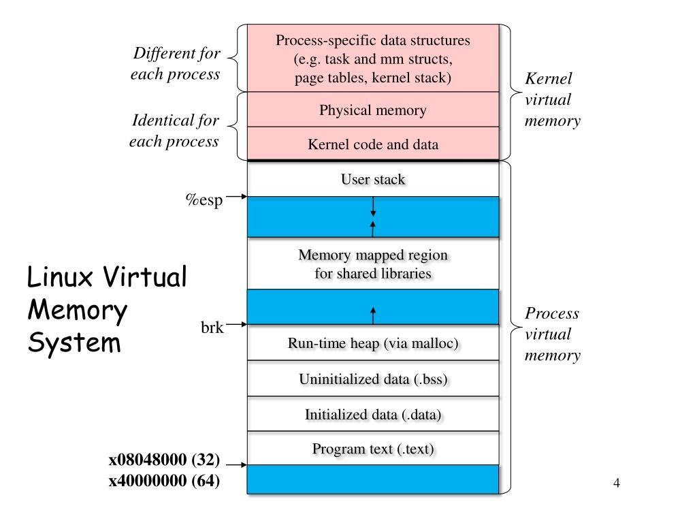

## 概览

当一个 C++ 程序被操作系统加载到内存后，操作系统会为它分配一个**独立的虚拟地址空间**。这样做的好处是：每个进程都拥有彼此隔离的运行环境，不会直接干扰其他进程的内存，既保证了安全性，也方便操作系统进行内存管理和调度。

在这个虚拟地址空间中，不同的内存区域有着各自的职责，就像一座工厂里不同的车间专门负责不同的生产任务。下表总结了这些区域的结构、作用及它们为何这么设计（以 32 位或简化的 64 位模型为例）：

| 区域                       | 说明                                    | 特点                               | 设计原因                                   | 增长方向     |
| -------------------------- | --------------------------------------- | ---------------------------------- | ------------------------------------------ | ------------ |
| **代码段 (.text)**         | 存放程序的机器指令                      | 只读，可共享，防止被意外修改       | 保障代码安全性和多进程共享效率             | 固定         |
| **已初始化数据段 (.data)** | 存放已初始化的全局/静态变量             | 可读写                             | 提前分配并初始化，方便快速访问             | 固定         |
| **未初始化数据段 (.bss)**  | 存放未初始化的全局/静态变量，启动时清零 | 可读写                             | 节省可执行文件大小，启动时由系统统一清零   | 固定         |
| **堆 (Heap)**              | 动态分配内存（`new` / `malloc`）        | 程序员手动分配与释放，易内存泄漏   | 提供灵活的内存分配能力，满足运行时变化需求 | 向高地址增长 |
| **内存映射区**             | 动态库、文件映射、共享内存等            | 灵活，可按需加载                   | 支持动态加载功能和高效的文件/进程间通信    | 不固定       |
| **栈 (Stack)**             | 函数调用帧、局部变量、参数、返回地址    | 系统自动管理，空间有限，可能栈溢出 | 提供快速的内存分配与释放机制，保证调用有序 | 向低地址增长 |
### Linux进程下的虚拟地址空间结构

## 内存布局与ELF文件结构的对应关系

ELF文件与内存中的部分区域映射关系如下：

- **ELF文件的`.text`节区** → 内存中的**代码段(.text)**
- **ELF文件的`.data`节区** → 内存中的**已初始化数据段(.data)**
- **ELF文件的`.bss`节区** → 内存中的**未初始化数据段(.bss)**
- **ELF文件的其他节区**（如`.rodata`、`.symtab`等）也会被映射到内存的相应区域

这种映射关系是由操作系统的装载器(Loader)根据ELF文件头(ELF Header)和程序头表(Program Header)中的信息完成的。程序头表中描述了每个段的类型、大小、偏移量和在内存中的地址等信息，装载器根据这些信息将ELF文件的各个部分加载到内存的对应位置。

## 内存区域详细介绍

@startjson
{
  "进程内存布局(32bit Linux)": {
    "kernelSpace": {
      "addressRange": "0xC0000000 - 0xFFFFFFFF (High Address)",
      "description": "操作系统内核保留区域",
      "accessibility": "用户代码不可访问"
    },
    "userSpace": {
      "addressRange": "0x00000000 - 0xBFFFFFFF",
      "regions": {
        "stackArea": {
          "addressRange": "高地址区域",
          "description": "栈区域",
          "purpose": "存放局部变量、函数参数和返回地址",
          "growthDirection": "向下增长 (向低地址方向)",
          "features": ["起始地址会被ASLR随机化", "包含命令行参数和环境变量"]
        },
        "memoryMappingArea": {
          "addressRange": "栈下方区域",
          "description": "内存映射区域",
          "purpose": "加载动态链接库和映射文件",
          "growthDirection": "通常向下增长",
          "features": ["起始地址会被ASLR随机化"]
        },
        "heapArea": {
          "addressRange": "内存映射区域下方",
          "description": "堆区域",
          "purpose": "动态内存分配 (malloc, new)",
          "growthDirection": "向上增长 (向高地址方向)",
          "features": ["起始地址会被ASLR随机化"]
        },
        "programImageSegments": {
          "addressRange": "堆下方区域",
          "description": "程序镜像段",
          "purpose": "存储程序的代码和数据",
          "segments": {
            "bss": "未初始化的全局/静态变量",
            "data": "已初始化的全局/静态变量",
            "rodata": "只读常量 (如字符串字面量)",
            "text": "可执行的机器代码 (程序逻辑)"
          },
          "features": ["大小在编译后固定"]
        },
        "reservedArea": {
          "addressRange": "0x00000000 附近",
          "description": "保留区域",
          "purpose": "防止和捕获 NULL 指针的解引用",
          "features": ["不可访问"]
        }
      }
    }
  }
}
@endjson

## 总结

程序的内存布局是在加载过程中由操作系统的装载器确定的，具体过程如下：

1. **创建虚拟地址空间**：操作系统为进程分配一个独立的虚拟地址空间。
2. **解析ELF文件**：装载器读取ELF文件头，获取程序的入口点地址、程序头表和节区头表的位置等信息。
3. **映射代码和数据**：根据程序头表中的信息，装载器将ELF文件的代码段（`.text`）、数据段（`.data`）和BSS段（`.bss`）映射到虚拟地址空间的对应位置。
4. **分配堆和栈空间**：装载器在虚拟地址空间中为堆和栈分配内存区域。堆通常位于数据段的上方，栈则位于用户空间的顶部。
5. **加载动态库**：如果程序依赖于动态库，装载器会将动态库加载到内存映射区，并更新程序中的符号引用。
6. **初始化**：最后，装载器调用C++运行时库（CRT）完成全局变量和静态变量的初始化，然后跳转到程序的入口点（通常是`main`函数）开始执行。

通过这个过程，ELF文件中的各个节区被映射到内存中的对应区域，形成了我们所看到的程序内存布局。
