## 1. Overview

编译就是将C++源代码转换为机器可以理解的格式的一个过程。对于计算机来说，它只能理解二进制编码，C++的源代码只是为了方便人类理解(`human-readable`)。所以, 为了让机器理解我们的代码，我们需要一个“翻译官”，也就是我们常说的编译器(`Compiler`), 编译器的工作就是将源代码转换机器语言，编译的过程也就是一个“翻译”的过程.
一个完整的编译过程主要分为以下四个阶段：

| 阶段 | 步骤名称                       | 输入                                 | 主要处理内容                                    | 输出                      |
| -- | -------------------------- | ---------------------------------- | ----------------------------------------- | ----------------------- |
| 1  | **预处理**<br>(Preprocessing) | C/C++ 源文件<br>(.c/.cpp, .h/.hpp)    | 移除注释、展开宏、处理 `#include`、执行条件编译，生成无预处理指令的源码 | 预处理文件<br>(.i / .ii)     |
| 2  | **编译**<br>(Compilation)    | 预处理文件<br>(.i / .ii)                | 词法分析、语法分析、语义分析、优化代码，生成对应的汇编代码             | 汇编文件<br>(.s / .asm)     |
| 3  | **汇编**<br>(Assembly)       | 汇编文件<br>(.s / .asm)                | 将汇编指令翻译为机器码，生成可重定位的目标文件                   | 目标文件<br>(.o / .obj)     |
| 4  | **链接**<br>(Linking)        | 目标文件与库文件<br>(.o / .obj, .lib / .a) | 合并多个目标文件与库，解决符号引用，生成完整的可执行程序              | 可执行文件<br>(.exe / a.out) |

::: tip

**Compilation** 这个词在C++语境下，既可以指代从源代码到可执行文件的整个完整过程，也可以特指其中“将代码翻译成汇编”这一个核心步骤，请注意区分。

:::

### 流程图概览

```mermaid
%%{init: {'theme': 'base', 'themeVariables': { 'primaryColor': '#ffffff', 'lineColor': '#000000', 'fontSize': '14px', 'textColor': '#000000', 'background': '#ffffff'}}}%%
flowchart LR
    A["💻 源代码<br>(main.cpp)"] --> B["📝 预处理<br>展开宏/包含头文件/移除注释<br>产物：main.i"]
    B --> C["⚙️ 编译<br>词法+语法+语义分析 → 生成汇编<br>产物：main.s"]
    C --> D["🔨 汇编<br>汇编代码 → 机器码<br>产物：main.o"]
    D --> E["🔗 链接<br>符号解析+地址分配 → 可执行文件<br>产物：main"]
    E --> F["▶️ 运行程序<br>输出：Hello, World!"]
```




## 2. 编译过程详解

### 2.1 预处理（Preprocessing）

编译过程的第一阶段，主要包含了以下动作：

| 阶段 | 步骤                    | 主要作用                                            | 示例                                           |
| ---- | ----------------------- | --------------------------------------------------- | ---------------------------------------------- |
| 1    | Comments removal        | 删除 `//` 和 `/*...*/` 中的注释内容，只保留有效代码 | `int a=1; // 变量` → `int a=1;`                |
| 2    | Macros expansion        | 将 `#define` 定义的宏替换为实际内容                 | `#define PI 3.14` → `area=3.14*r*r;`           |
| 3    | File inclusion          | 将 `#include` 引用的头文件内容直接插入到代码中      | `#include <stdio.h>` → 插入 `stdio.h` 文件内容 |
| 4    | Conditional compilation | 根据条件指令选择性保留或删除代码                    | `#ifdef DEBUG` 包含调试代码，否则移除          |

### 2.2 编译(Complication)

编译阶段的核心任务是将**预处理后的源代码**翻译成汇编代码。这个过程中，编译器不仅会检查代码的正确性，还会进行优化，以便生成高效的目标程序。主要步骤如下：

| 阶段 | 步骤         | 主要作用                                                     | 示例                                         |
| ---- | ------------ | ------------------------------------------------------------ | -------------------------------------------- |
| 1    | 词法分析     | 将源码拆分为**词法单元（Token）**，如关键字、标识符、常量、运算符等 | `int a=5;` → `int`、`a`、`=`、`5`、`;`       |
| 2    | 语法分析     | 根据语法规则将 Token 组织成**语法树（AST）**，并检测语法合法性 | 检查 `if(a==5){}` 是否符合 C++ 标准语法      |
| 3    | 语义分析     | 确保程序语义正确（类型匹配、变量声明、作用域等）             | 检查变量是否已定义、函数调用参数类型是否匹配 |
| 4    | 中间代码生成 | 将 AST 转换为平台无关的**中间表示（IR）**                    | 生成 LLVM IR / GCC GIMPLE                    |
| 5    | 代码优化     | 对 IR 进行优化（删除冗余、循环优化、函数内联等）             | 将 `x = x + 0` 优化掉                        |
| 6    | 汇编代码生成 | 将优化后的 IR 转换为对应 CPU 架构的汇编代码                  | 生成 `.s` 文件，如 `mov eax,1`               |

### 2.3 汇编（Assembly）

汇编阶段的任务是将**汇编代码**翻译成机器指令，并生成可供链接器处理的目标文件。主要步骤如下：

| 阶段 | 步骤         | 主要作用                                                   | 示例                              |
| ---- | ------------ | ---------------------------------------------------------- | --------------------------------- |
| 1    | 指令翻译     | 将汇编指令转化为 CPU 可识别的机器码                        | `mov eax,1` → `B8 01 00 00 00`    |
| 2    | 符号记录     | 在目标文件中保存函数、变量等符号的占位符，以供链接阶段解析 | `printf` 在符号表中留下未解析引用 |
| 3    | 生成目标文件 | 输出 `.o`（Unix/Linux）或 `.obj`（Windows）文件            | 生成 `main.o`                     |

### 2.4 链接(Linking)

链接阶段会将多个目标文件与所需的库文件组合成一个完整的可执行文件。这个过程不仅解决符号引用，还会将程序的各个部分整合为一个整体。主要步骤如下：

| 阶段 | 步骤               | 主要作用                                                     | 示例                                 |
| ---- | ------------------ | ------------------------------------------------------------ | ------------------------------------ |
| 1    | 符号解析           | 查找并匹配各目标文件和库中的符号引用与定义                   | 在 `libc` 中找到 `printf` 的实现     |
| 2    | 地址分配（重定位） | 为代码和数据分配最终内存地址，并替换占位符                   | 将 `printf` 的调用地址替换为实际地址 |
| 3    | 合并段（Sections） | 将各文件的 `.text`（代码段）、`.data`（数据段）等合并        | 合并 `main.o` 与库文件的代码段       |
| 4    | 生成可执行文件     | 输出 `.exe`（Windows）或 `a.out / ELF`（Unix/Linux）可直接运行的程序 | 生成 `main.exe` 或 `a.out`           |

## 3 动手观察

下面是一个在 Ubuntu 系统中观察 C/C++ 程序编译全流程及产物的完整操作步骤，你可以用它在自己的机器上实验每一步：

### 3.1 创建源文件

创建一个`main.cpp`，编辑内容如下：

```c++
// this is my test program
#include <stdio.h>

int main() {
    printf("Hello, World!\\n");
    return 0;
}
```

### 3.2 预处理

使用 `g++ -E main.cpp -o main.i` 模拟该过程，该命令会生成一个 `main.i` 的产物。

::: details 

```bash
wayne@server:~/source/temp$ ll
total 12
drwxrwxr-x 2 wayne wayne 4096 Aug 10 11:43 ./
drwxrwxr-x 7 wayne wayne 4096 Aug 10 11:43 ../
-rw-rw-r-- 1 wayne wayne   81 Aug 10 11:42 main.cpp
wayne@server:~/source/temp$ g++ -E main.cpp -o main.i
wayne@server:~/source/temp$ ll
total 36
drwxrwxr-x 2 wayne wayne  4096 Aug 10 11:43 ./
drwxrwxr-x 7 wayne wayne  4096 Aug 10 11:43 ../
-rw-rw-r-- 1 wayne wayne    81 Aug 10 11:42 main.cpp
-rw-rw-r-- 1 wayne wayne 20890 Aug 10 11:43 main.i
wayne@server:~/source/temp$ cat main.i 
# 0 "main.cpp"
# 0 "<built-in>"
# 0 "<command-line>"
# 1 "/usr/include/stdc-predef.h" 1 3 4
# 0 "<command-line>" 2
# 1 "main.cpp"
# 1 "/usr/include/stdio.h" 1 3 4
# 27 "/usr/include/stdio.h" 3 4
# 1 "/usr/include/x86_64-linux-gnu/bits/libc-header-start.h" 1 3 4
# 33 "/usr/include/x86_64-linux-gnu/bits/libc-header-start.h" 3 4
```

:::

### 3.3 编译

执行命令 `g++ -S main.i -o main.s`，我们可以得到汇编代码产物 `main.s`。

::: details

```bash
wayne@server:~/source/temp$ ll
total 36
drwxrwxr-x 2 wayne wayne  4096 Aug 10 11:48 ./
drwxrwxr-x 7 wayne wayne  4096 Aug 10 11:43 ../
-rw-rw-r-- 1 wayne wayne    81 Aug 10 11:42 main.cpp
-rw-rw-r-- 1 wayne wayne 20890 Aug 10 11:43 main.i
wayne@server:~/source/temp$ g++ -S main.i -o main.s
wayne@server:~/source/temp$ head -n 20 main.s
        .file   "main.cpp"
        .text
        .section        .rodata
.LC0:
        .string "Hello, World!\\n"
        .text
        .globl  main
        .type   main, @function
main:
.LFB0:
        .cfi_startproc
        endbr64
        pushq   %rbp
        .cfi_def_cfa_offset 16
        .cfi_offset 6, -16
        movq    %rsp, %rbp
        .cfi_def_cfa_register 6
        leaq    .LC0(%rip), %rax
        movq    %rax, %rdi
        movl    $0, %eax
wayne@server:~/source/temp$ 
```

:::

### 3.4 汇编

执行命令 `g++ -o main.o -c main.s`，我们可以得到汇编代码产物 `main.o`。

其余命令介绍：

```bash
file main.o     # 显示文件类型（ELF 64-bit Relocatable object）
hexdump -C main.o | head  # 查看二进制内容
readelf -s main.o         # 查看符号表
```

::: details

```bash
wayne@server:~/source/temp$ ll
total 40
drwxrwxr-x 2 wayne wayne  4096 Aug 10 11:52 ./
drwxrwxr-x 7 wayne wayne  4096 Aug 10 11:43 ../
-rw-rw-r-- 1 wayne wayne    81 Aug 10 11:42 main.cpp
-rw-rw-r-- 1 wayne wayne 20890 Aug 10 11:43 main.i
-rw-rw-r-- 1 wayne wayne   687 Aug 10 11:48 main.s
wayne@server:~/source/temp$ g++ -o main.o -c main.s
wayne@server:~/source/temp$ file main.o
main.o: ELF 64-bit LSB relocatable, x86-64, version 1 (SYSV), not stripped
wayne@server:~/source/temp$ hexdump -C main.o | head 
00000000  7f 45 4c 46 02 01 01 00  00 00 00 00 00 00 00 00  |.ELF............|
00000010  01 00 3e 00 01 00 00 00  00 00 00 00 00 00 00 00  |..>.............|
00000020  00 00 00 00 00 00 00 00  60 02 00 00 00 00 00 00  |........`.......|
00000030  00 00 00 00 40 00 00 00  00 00 40 00 0e 00 0d 00  |....@.....@.....|
00000040  f3 0f 1e fa 55 48 89 e5  48 8d 05 00 00 00 00 48  |....UH..H......H|
00000050  89 c7 b8 00 00 00 00 e8  00 00 00 00 b8 00 00 00  |................|
00000060  00 5d c3 48 65 6c 6c 6f  2c 20 57 6f 72 6c 64 21  |.].Hello, World!|
00000070  5c 6e 00 00 47 43 43 3a  20 28 55 62 75 6e 74 75  |\n..GCC: (Ubuntu|
00000080  20 31 31 2e 34 2e 30 2d  31 75 62 75 6e 74 75 31  | 11.4.0-1ubuntu1|
00000090  7e 32 32 2e 30 34 29 20  31 31 2e 34 2e 30 00 00  |~22.04) 11.4.0..|
wayne@server:~/source/temp$ readelf -s main.o 

Symbol table '.symtab' contains 6 entries:
   Num:    Value          Size Type    Bind   Vis      Ndx Name
     0: 0000000000000000     0 NOTYPE  LOCAL  DEFAULT  UND 
     1: 0000000000000000     0 FILE    LOCAL  DEFAULT  ABS main.cpp
     2: 0000000000000000     0 SECTION LOCAL  DEFAULT    1 .text
     3: 0000000000000000     0 SECTION LOCAL  DEFAULT    5 .rodata
     4: 0000000000000000    35 FUNC    GLOBAL DEFAULT    1 main
     5: 0000000000000000     0 NOTYPE  GLOBAL DEFAULT  UND printf
wayne@server:~/source/temp$ 
```

:::

### 3.5 链接（生成可执行文件）

执行命令 `g++ main.o -o main`， 得到最终的可执行文件, 文件格式为`elf`类型(`linux`上的可执行文件格式)

其余命令介绍：

```bash
file main     # 显示为 ELF 64-bit LSB executable
readelf -h main  # 查看 ELF 文件头
```

::: details

```bash
wayne@server:~/source/temp$ ll
total 44
drwxrwxr-x 2 wayne wayne  4096 Aug 10 11:52 ./
drwxrwxr-x 7 wayne wayne  4096 Aug 10 11:43 ../
-rw-rw-r-- 1 wayne wayne    81 Aug 10 11:42 main.cpp
-rw-rw-r-- 1 wayne wayne 20890 Aug 10 11:43 main.i
-rw-rw-r-- 1 wayne wayne  1504 Aug 10 11:52 main.o
-rw-rw-r-- 1 wayne wayne   687 Aug 10 11:48 main.s
wayne@server:~/source/temp$ g++ main.o -o main
wayne@server:~/source/temp$ file main 
main: ELF 64-bit LSB pie executable, x86-64, version 1 (SYSV), dynamically linked, interpreter /lib64/ld-linux-x86-64.so.2, BuildID[sha1]=fc45d54bd23fe46646071b84ab26edd4acc85693, for GNU/Linux 3.2.0, not stripped
wayne@server:~/source/temp$ readelf -h main
ELF Header:
  Magic:   7f 45 4c 46 02 01 01 00 00 00 00 00 00 00 00 00 
  Class:                             ELF64
  Data:                              2's complement, little endian
  Version:                           1 (current)
  OS/ABI:                            UNIX - System V
  ABI Version:                       0
  Type:                              DYN (Position-Independent Executable file)
  Machine:                           Advanced Micro Devices X86-64
  Version:                           0x1
  Entry point address:               0x1060
  Start of program headers:          64 (bytes into file)
  Start of section headers:          13976 (bytes into file)
  Flags:                             0x0
  Size of this header:               64 (bytes)
  Size of program headers:           56 (bytes)
  Number of program headers:         13
  Size of section headers:           64 (bytes)
  Number of section headers:         31
  Section header string table index: 30
wayne@server:~/source/temp$ 
```

:::
