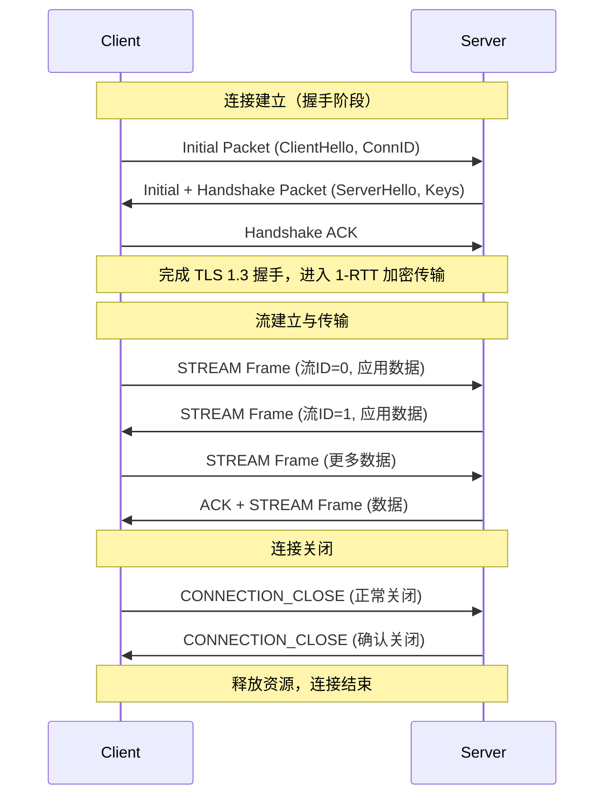

::: important
本文写作思路按照[RFC9000](https://www.rfc-editor.org/rfc/rfc9000.html)对`QUIC`协议进行详细解析, 也建议大家去阅读一下原文
:::

## 概览

我在 [HTTP进化史](/docs/network/http/evolution.md#航海新时代-http3) 简单介绍了`HTTP/3`的一个基本工作机制以及它诞生的一个背景。在`HTTP/3`的标准里面，`TCP`不在作为`HTTP`的基础传输层，取而代之的是`QUIC`协议。

`QUIC(Quick UDP Internet Connections)`协议最开始由`Google`公司提出，并且在2021年，被IEFT组织标准化。`QUIC`协议提出的为了构建一种新的`HTTP`技术标准，来达成一种更快，更安全，更可靠的网络数据传输，从而替换掉基于`TCP` + `TLS`的主流`HTTP/2`标准。

`QUIC`也可以被理解为一种传输层协议，不同于传统的传输层，`QUIC`是基于`UDP`构建，严格意义来讲，它也可以算是一种应用层协议了。

它是一种**面向连接的(connection-oriented)**，**有状态的(stateful)**，用于解决**client-server间通信**的一个**安全**传输协议。后文将详细介绍基于这几个属性，`QUIC`协议是如何实现的。

`QUIC`的几大核心特点包括了，**0-RTT恢复连接**， **安全传输**，以及解决了**队头阻塞**问题。首先，`0-RTT`的实现原理是在`QUIC`建立连接的握手(`handshake`)阶段就完成了加密通信和传输参数的协商，避免了基于`TCP`的三次握手和`TLS`的四次握手的多次RTT耗费，在两次握手完成了所有的协商过程(第二次握手的ACK报文已经可以携带数据载荷(`payload`), 所以将其叫做`0-RTT`，当前这需要实现特殊的配置开启下才能启用)。

每个QUIC协议的数据包(`packets`)都将QUIC协议以帧(`frame`)结构来划分，每一帧既包含了协议的控制信息，也包含了应用数据, 这一部分，我们通常把它叫做帧的载荷(`payload`)。基于`QUIC`的应用协议数据在`QUIC`里面是流式传输的，这意味着所有的上层应用数据都会经过一系列的操作将其序列化后交由`QUIC`协议发送。

`QUIC`提供的是可靠数据传输，并提供了拥塞检测和避免机制，与TCP最大的不同是，它还实现了数据丢失的检测和恢复机制，而不是直接通过数据重传来实现，极大提升了数据的传输效率，很大程度上解决了**队头阻塞**的问题。





::: tip

**队头阻塞**：这描述的是串行化任务执行过程中，由于前置任务没有及时完成，导致后续任务无法继续执行的一种现象。在`HTTP/3`之前，`HTTP`协议中并没有一个好的设计来解决批量的请求处理，所有的请求在服务端只能顺序处理，由于其底层协议是使用TCP协议，一旦TCP出现拥塞和丢包，基于这个连接的所有请求被迫进入等待，知道数据传输恢复，这就出现了所谓的队头阻塞问题。
:::

## Streams(流机制)

`Streams`是`QUIC`协议中最核心，最具创新的机制之一。它不仅解决了`TCP`中的队头阻塞，同时也为应用层(`HTTP/3`)提供了高效的并发传输能力。

### 流的定义

QUIC 的流是一种 **轻量级的、独立的、双向或单向的数据通道**，运行在 `QUIC` 连接之上。每个连接可以包含多个流，彼此之间 **完全独立**，互不干扰。简单理解，流就是基于单个QUIC连接上的抽象数据通道，一个连接允许同时存在多个流，且同时可以操作任意数量的流发送任意数量大小的数据，以此来实现高效的并行数据传输。

### 流的分类

| 类型                                | 描述                     | 应用场景                         |
| ----------------------------------- | ------------------------ | -------------------------------- |
| **双向流（Bidirectional Stream）**  | 双方都可以发送和接收数据 | 适用于 HTTP 请求和响应           |
| **单向流（Unidirectional Stream）** | 只有一方发送，另一方接收 | 适用于服务器推送、控制信息传输等 |
### Stream ID
每个流都有一个唯一的 **Stream ID**，并且 ID 的奇偶性表示流的发起方：
- 客户端发起的流：ID 为偶数
- 服务器发起的流：ID 为奇数

在报文中，流ID是一个可变长度的整数，流 ID 的第二个最低有效位（0x02）区分双向流（该位设置为 0）和单向流（该位设置为 1)。

### 数据帧(Stream frames)

在流中的数据会被切分为固定大小的分片，这些分片被称之为帧,  每个帧都将携带流ID以及分片的索引(offset， 可以理解为分片编号), 用于接收端的数据重组，使用offset保证数据包按序组装后，传递给上层应用协议。
一个大致的帧结构如下:

```bash
STREAM Frame {
  Type (1 byte)                // 包含标志位
  Stream ID (varint)           // 流的唯一标识符
  [Offset (varint)]            // 数据在流中的偏移量（可选）
  [Length (varint)]            // 数据长度（可选）
  [FIN (flag)]                 // 是否为流的最后一帧（可选）
  Data (bytes)                 // 实际传输的数据
}
```

### 与TCP的对比


从上图可以看出，针对`QUIC`协议，单个连接可以提供多个并发工作的流来模拟并行数据传输，对于TCP来说，单个流只能串行化传输业务数据，单个数据包丢失或者延迟抵达接收端会导致基于该连接的所有业务阻塞。

## 流量控制

流量控制的核心目标都是防止发送方发送过多的数据，导致接收方缓冲区溢出造成数据丢失。
`QUIC`在连接和流两个层面都实现了流控机制，这就意味着每个流有自己的流量限制，流所在的连接也有一个总体限制。

### 双层流控

| 层级                             | 控制对象         | 描述                             |
| -------------------------------- | ---------------- | -------------------------------- |
| **流级别（Stream-level）**       | 单个流的数据量   | 控制每个流能发送多少数据         |
| **连接级别（Connection-level）** | 所有流的总数据量 | 控制整个连接中所有流的累计数据量 |

### 关键帧机制

QUIC 使用以下帧来实现流控：

| 帧类型                | 作用                                     |
| --------------------- | ---------------------------------------- |
| `MAX_STREAM_DATA`     | 告诉发送方：某个流最多可以发送多少字节   |
| `MAX_DATA`            | 告诉发送方：整个连接最多可以发送多少字节 |
| `STREAM_DATA_BLOCKED` | 发送方通知接收方：当前流被流控阻塞了     |
| `DATA_BLOCKED`        | 发送方通知接收方：整个连接被流控阻塞了   |

当然，这些帧是动态协商的，随着数据传输，接收方可以逐步提升限制，让发送方继续发送更多数据。
与`TCP`不同的是，`QUIC`的流控实并不是像`TCP`那样，是一个滑动的窗口，它是一个固定的窗口，如果客户端很快就发送好了最开始接收方告诉发送方指定窗口大小的数据，发送方不得不立即停止发送，直到接收发送新的窗口大小消息过来，发送方才可以继续发送。

### QUIC流控 VS  TCP流控

| 维度             | TCP 流控             | QUIC 流控                                      |
| ---------------- | -------------------- | ---------------------------------------------- |
| **控制粒度**     | 整个连接             | 每个流 + 整个连接                              |
| **机制类型**     | 滑动窗口             | 显式窗口更新（`MAX_STREAM_DATA` / `MAX_DATA`） |
| **反馈方式**     | 隐式（`ACK` 驱动）   | 显式帧通知                                     |
| **多路复用支持** | 不支持（单一字节流） | 支持并发多流，每个流独立流控                   |
| **协议层位置**   | 内核 `TCP` 栈        | 用户态 `QUIC` 实现                             |
| **阻塞影响范围** | 整个连接阻塞         | 单个流阻塞不影响其他流                         |

## 参考

以下是QUIC协议相关的RFC文档整理：

**🌐 QUIC 核心规范**：QUIC 协议基础功能的关键文档

| RFC编号  | 标题                                | 内容简介                                   |
| -------- | ----------------------------------- | ------------------------------------------ |
| RFC 8999 | QUIC 的版本无关属性                 | 定义了 QUIC 协议的通用属性，适用于所有版本 |
| RFC 9000 | QUIC: 基于 UDP 的多路复用和安全传输 | QUIC 协议的核心传输机制                    |
| RFC 9001 | 使用 TLS 保护 QUIC                  | 描述了如何将 TLS 集成到 QUIC 中进行加密    |
| RFC 9002 | QUIC 的丢包检测与拥塞控制           | 定义了 QUIC 的网络性能管理机制             |

**🧩 QUIC 扩展规范**： QUIC 的功能扩展和新版本定义

| RFC编号  | 标题                    | 内容简介                               |
| -------- | ----------------------- | -------------------------------------- |
| RFC 9221 | QUIC 的不可靠数据报扩展 | 支持非可靠传输场景                     |
| RFC 9287 | QUIC 位增强             | 改进了协议中的位字段处理               |
| RFC 9368 | QUIC 版本协商           | 支持客户端和服务器协商使用的 QUIC 版本 |
| RFC 9369 | QUIC 版本 2             | 定义了 QUIC 的第二个版本规范           |

**📡 应用性与管理性相关规范**：以下文档用于指导开发者和运营商理解如何部署和管理 QUIC

| RFC编号  | 标题            | 内容简介                               |
| -------- | --------------- | -------------------------------------- |
| RFC 9308 | QUIC 的适用性   | 讨论了 QUIC 在不同应用场景中的使用建议 |
| RFC 9312 | QUIC 的可管理性 | 提供了网络管理和监控方面的指导         |

🌐 **与 HTTP/3 相关的 RFC**：介绍基于QUIC协议和HTTP/3协议

| FC编号   | 标题   | 内容简介                            |
| -------- | ------ | ----------------------------------- |
| RFC 9114 | HTTP/3 | 定义了基于 QUIC 的 HTTP 协议        |
| RFC 9204 | QPACK  | HTTP/3 的头部压缩机制，替代了 HPACK |
